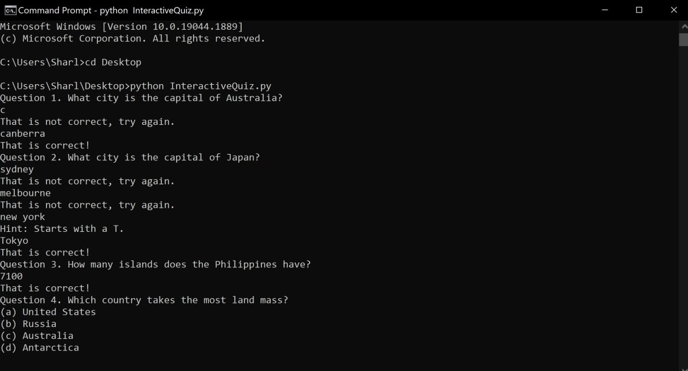

# python-interactive-quiz

This is based on the interactive quiz tutorial in MUO.

This tutorial includes the different questions you can ask a user in a quiz. Many modifications are made to the code in the tutorial based on the different types of questions you can ask, so each folder contains a working script for each checkpoint/section.

## Prerequisites

- Make sure you have [Python](https://www.python.org/downloads/) on your computer.

## To Run

- Open the command line or terminal, and navigate to the file where the python script is stored. For example: `cd C:\Users\Sharl\Desktop`
- Run the python command: `python InteractiveQuiz.py`
- The quiz will start.

## Example

